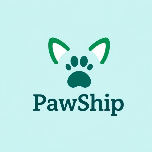

# Pawship - Find Your Pawfect Partner

  

  <a href="https://sandbox.bulme.at/~tobias.prasser/">Besuche unsere Website</a>

Willkommen bei **Pawship** – der besten Plattform, um dein ideales Haustier zu finden! Wir verbinden Tierfreunde mit ihren perfekten tierischen Begleitern. Bei uns findest du nicht nur einen neuen Freund, sondern auch einen Partner fürs Leben. Unser Ziel ist es, Tieren ein Zuhause zu geben und Menschen mit ihren treuen Begleitern zusammenzubringen.

## Funktionen

- **Einfacher Zugang** zu einer Vielzahl von Tieren, die ein neues Zuhause suchen
- **Detaillierte Profile** jedes Tieres mit Bildern, Beschreibung und Bedürfnissen
- **Suchfilter** nach Größe, Alter, Rasse, Persönlichkeit und mehr
- **Direktnachrichten**: Kontaktiere Tierheim-Mitarbeiter und erhalte mehr Informationen zu den Tieren
- **Sicherer Umgang**: Wir stellen sicher, dass alle Tiere in sichere Hände kommen

## Wie es funktioniert

1. **Erstelle ein Konto**: Registriere dich als Tierheim oder potenzieller Tierbesitzer.
2. **Durchstöbere Tiere**: Suche nach Tieren, die zu dir passen.
3. **Kontaktiere das Tierheim**: Wenn du dein "Pawfect Partner" gefunden hast, kontaktiere das Tierheim für weitere Details und eine mögliche Adoption.
4. **Erlebe die Freude**: Nimm dein neues Familienmitglied zu dir nach Hause!

## Projekt für MEDT

**Namensidee:** Pawship

**Logo:** Vielleicht ähnlich wie Parship

**Product:** Tiervermittlung

**Farbschema:** Vielleicht Grün/Blau(Hellblau)

## Rollen

**ScrumMaster:** Nevena

**ProductOwner:** Philipp

**Developer:**

- Gernot
- Tobias
- Alex
- Johanna
- Max

## Installation

## For React:

### Step 1: Clone/Pull Repository

**git clone Repository link**\

### Step 2: Move into the Pawship/pawship directory

### Step 3: NPM Install

### Step 4: npm start

### Step 5: Have fun
